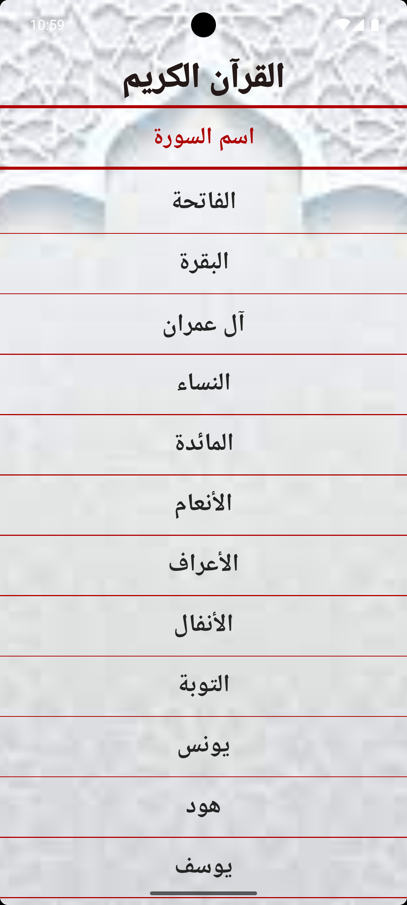
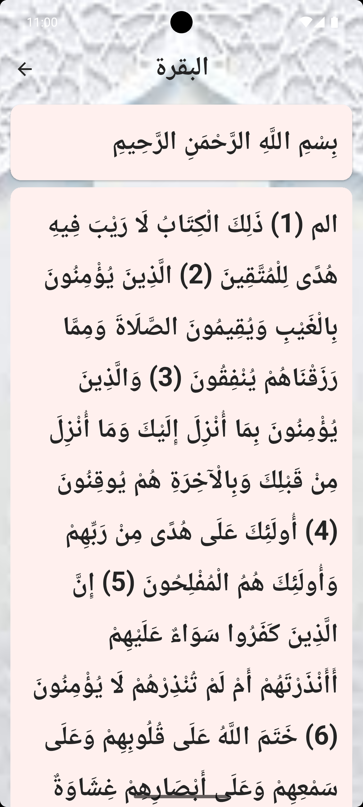

📖 QuraanApp

A simple and lightweight Qur'an reading application built with Flutter and designed for a clean and comfortable Arabic reading experience.

QuraanApp provides an easy way to browse the Qur'an by Surah and read its verses directly from local application assets, allowing the main reading experience to work without requiring an internet connection.

✨ Features
📚 Browse all Qur'an Surahs from a simple and organized list.
📖 Open any Surah and read its verses verse by verse.
📴 Offline-first reading using local Qur'an text assets.
↔️ Full right-to-left Arabic text support.
🎨 Clean Material 3 interface.
🖼️ Custom application background and branding.
⚡ Lightweight and fast with local data loading.
📱 Simple navigation between the Surah list and reading screen.
📸 Screenshots

<table> <tr> <td align="center"> <strong>Home Screen</strong>    </td> <td align="center"> <strong>Surah Reading Screen</strong>    </td> </tr> </table>

🛠️ Built With
Flutter
Dart
Material 3
Local Flutter Assets
📂 Project Structure
lib/
├── main.dart
├── home_screen.dart
├── quraantap.dart
├── itemsouraname.dart
├── souradetail.dart
├── souradata.dart
├── mytheam.dart
└── appcolors.dart

assets/
├── files/
│   └── Qur'an text files
└── img/
    ├── branding.jpg
    ├── bachgound.jpg
    ├── logo.jpg
    ├── imagelite.jpg
    └── imagedark.jpg

screenshots/
├── homepage.png
└── sora.png
🚀 Getting Started
Prerequisites

Make sure you have Flutter installed on your system.

You can verify your Flutter installation with:

flutter doctor
Installation

Clone the repository:

git clone https://github.com/YOUR_USERNAME/quraan-app.git

Move into the project directory:

cd quraanapp

Install dependencies:

flutter pub get

Run the application:

flutter run
📦 Build

To build a release APK for Android:

flutter build apk --release

To build an Android App Bundle:

flutter build appbundle --release

The repository may intentionally exclude generated platform/build files to keep the project lightweight. If needed, regenerate Flutter platform folders with flutter create ..

📖 How It Works

The application stores Surah data inside the project's local assets.

Each Surah is loaded from:

assets/files/

When the user selects a Surah, QuraanApp loads the corresponding text file using Flutter's asset bundle and displays the verses with right-to-left Arabic formatting.

This approach keeps the core reading experience simple and independent of an external API or server.

🎯 Project Goals

QuraanApp is intended to provide:

A minimal and distraction-free Qur'an reading experience.
Fast access to Surahs.
Offline reading.
A simple codebase that is easy to understand and extend.
🔮 Possible Future Improvements

Some features that could be added in future versions include:

🔖 Bookmarks and favorites.
🔍 Surah and verse search.
🌙 Dark mode.
🔤 Adjustable Arabic text size.
📍 Continue reading from the last position.
🎧 Audio recitation.
🌐 Translation support.
📊 Reading progress tracking.
⚠️ Content & Asset Notice

The source code of this project is licensed under the MIT License.

However, the Qur'an text files, images, artwork, logos, or other assets included in the project may originate from different sources and may be subject to separate copyright or usage terms.

Before redistributing or using these assets commercially, verify their original sources and applicable licenses.

📄 License

The original source code of this project is released under the MIT License.

See the LICENSE file for the full license text.

🤝 Contributing

Contributions, improvements, and bug fixes are welcome.

To contribute:

Fork the repository.
Create a new branch.
Make your changes.
Commit your changes.
Open a Pull Request.
